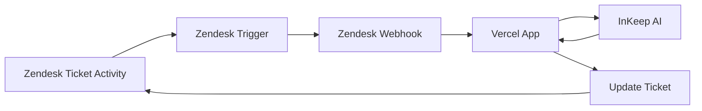

# Zendesk AI Auto Responder

This template repo contains a NextJS app as well as bash scripts that will help you configure your Zendesk workspace to use InKeep to auto-respond to new tickets using your InKeep project.

## Architecture Overview

The integration works by connecting three systems:



**How it works:**
1. **Zendesk** detects new ticket activity and fires a trigger
2. **Zendesk webhook** sends ticket data to your **Vercel app**
3. **Vercel app** calls **InKeep** to generate an AI response
4. **InKeep** returns the AI response to **Vercel**
5. **Vercel** posts the response back to **Zendesk** as a ticket comment

## Complete Setup Guide

Follow these steps in order to set up the Zendesk AI Auto Responder:

### Step 1: Fork and Deploy to Vercel

1. **Fork this repository** to your GitHub account or organization
2. **Deploy to Vercel** using the button below:

[](https://vercel.com/new/clone?repository-url=https%3A%2F%2Fgithub.com%2Finkeep%2Fzendesk-inkeep-template&env=ZENDESK_SUBDOMAIN,ZENDESK_API_TOKEN,ZENDESK_API_USER,AUTO_RESPONDER_INKEEP_API_KEY&envDescription=API%20keys%20required%20for%20successful%20deployment&project-name=zendesk-inkeep-autoresponder&repository-name=zendesk-inkeep-autoresponder)

**Important:** During Vercel deployment, you'll be prompted for environment variables. However, these are only used by the deployed app - you'll still need to configure them locally for the setup script.

### Step 2: Clone Locally and Configure Environment

1. **Clone your forked repository** to your local machine:
```bash
git clone https://github.com/YOUR-USERNAME/zendesk-inkeep-autoreply-template.git
cd zendesk-inkeep-autoreply-template
```

2. **Create environment file** by copying the sample:
```bash
cp .env.sample .env
```

3. **Edit `.env` file** with your actual values:

**Required variables:**
- `ZENDESK_SUBDOMAIN`: Your Zendesk subdomain (e.g., if your Zendesk URL is mycompany.zendesk.com, enter 'mycompany')
- `ZENDESK_API_TOKEN`: Generate at [Zendesk API token docs](https://support.zendesk.com/hc/en-us/articles/4408889192858-Generating-a-new-API-token)
- `ZENDESK_API_USER`: Email address of your Zendesk user
- `AUTO_RESPONDER_INKEEP_API_KEY`: Your InKeep API key
- `ZENDESK_WEBHOOK_SECRET`: A secret key for webhook security [docs](https://developer.zendesk.com/documentation/webhooks/verifying/)
- `AI_PROCESSING_ENDPOINT`: **Your Vercel deployment URL + `/api/webhook`** (e.g., `https://your-app-name.vercel.app/api/webhook`)

**Optional variables:**
- `AI_AGENT_USER_ID`: The User ID you'd like the AI bot to have if leaving internal comments
- `ENABLE_PUBLIC_RESPONSES`: Set to "true" to make AI responses visible to customers (defaults to internal responses only)

### Step 3: Install Prerequisites

**Install jq** (required for the setup script):
- **macOS**: `brew install jq`
- **Windows**: Download from [jq website](https://jqlang.github.io/jq/download/)

### Step 4 : Run Setup Script

Run the setup script to create the Zendesk webhook and trigger:
```bash
chmod +x ./webhook_setup/setup.sh
./webhook_setup/setup.sh
```

## Troubleshooting

### Setup Issues

#### Webhook Not Created During Setup
**Problem:** The setup script runs but no webhook appears in Zendesk.

**Possible causes:**
1. **Missing environment variables** - Ensure all required variables are set in your `.env` file
2. **Invalid API credentials** - Verify your `ZENDESK_API_USER` and `ZENDESK_API_TOKEN` are correct
3. **Wrong subdomain** - Double-check your `ZENDESK_SUBDOMAIN` value
4. **Incorrect endpoint URL** - Ensure `AI_PROCESSING_ENDPOINT` is your Vercel URL + `/api/webhook`

**Solution:** Check the setup script output for error messages and verify your `.env` configuration.

### Webhook/Trigger Issues
If you experience problems with the webhook or trigger:

1. Manually deactivate them in Zendesk:
   - Visit `https://YOUR-SUBDOMAIN.zendesk.com/admin/objects-rules/rules/triggers`
   - Replace YOUR-SUBDOMAIN with your Zendesk subdomain

2. Or run the cleanup script to remove the trigger/webhook pair:
```bash
chmod +x ./webhook_setup/cleanup.sh
./webhook_setup/cleanup.sh
```

## Debug Mode

By default, the AI Autoresponder runs in debug mode (internal notes only). In this mode, responses will only be visible to your support team as internal notes and not to the end-users.

To enable customer-facing responses:

1. Set the environment variable: `ENABLE_PUBLIC_RESPONSES=true`
2. Redeploy the application

When `ENABLE_PUBLIC_RESPONSES` is not set or is set to any value other than "true", the AI Auto Responder will only create internal notes (not visible to end-users) when responding to tickets.