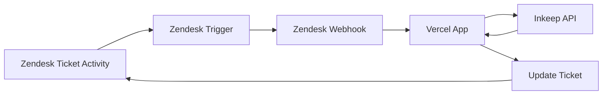

# Zendesk AI Auto Responder Template

This template repo contains a NextJS app as well as bash scripts that will help you configure your Zendesk workspace to use Inkeep to auto-respond to new tickets using your Inkeep project.

> [!IMPORTANT]  
> This is a only template repo. Given your integration requirements, you will want to make additional changes to this template.

## Architecture Overview

The integration works by connecting three systems:


```mermaid
graph LR
    A[Zendesk Ticket Activity] --> B[Zendesk Trigger]
    B --> C[Zendesk Webhook]
    C --> D[Vercel App]
    D --> E[Inkeep API]
    E --> D
    D --> F[Update Ticket]
    F --> A
```

**How it works:**
1. **Zendesk** detects new ticket activity and fires a trigger
2. **Zendesk webhook** sends ticket data to your **Vercel App**
3. **Vercel app** calls the **Inkeep API** to generate an AI response
4. **Inkeep API** returns the AI response to **Vercel**
5. **Vercel App** posts the response back to **Zendesk** as a ticket comment

## Complete Setup Guide

Follow these steps in order to set up the Zendesk AI Auto Responder:

> **Note:** Zendesk is removing API tokens as an authentication method. Starting July 28, 2026, tokens unused for 30 days will be automatically deleted. By April 30, 2027, all API tokens will stop working. You must [migrate your integrations to OAuth access tokens](https://developer.zendesk.com/documentation/api-basics/authentication/oauth-migration/) before the final deadline. This change only affects APIs that currently use API tokens including the Ticketing, Help Center, and Voice APIs. It does not apply to other Zendesk products. See [Managing API token access to the Zendesk API](https://support.zendesk.com/hc/en-us/articles/4408889192858-Managing-API-token-access-to-the-Zendesk-API).

### Step 1: Create Zendesk OAuth Clients

In Zendesk Admin Center, go to **Apps and integrations > APIs > OAuth clients** and create a confidential OAuth client.

The deployed application requests these least-privilege scopes:

```text
tickets:read tickets:write users:read organizations:read
```

The local setup scripts manage account configuration and request these scopes:

```text
webhooks:read webhooks:write triggers:read triggers:write
```

For least privilege, use separate OAuth clients for the deployed runtime and local provisioning scripts. They use the same environment variable names in their respective Vercel and local environments. Store each client secret securely; Zendesk shows it only when the client is created.

### Step 2: Deploy Template to Vercel

1. **Deploy to Vercel** using the button below:

[](https://vercel.com/new/clone?repository-url=https%3A%2F%2Fgithub.com%2Finkeep%2Fzendesk-inkeep-template&env=ZENDESK_SUBDOMAIN,ZENDESK_OAUTH_CLIENT_ID,ZENDESK_OAUTH_CLIENT_SECRET,AUTO_RESPONDER_INKEEP_API_KEY,ZENDESK_WEBHOOK_SECRET&envDescription=OAuth%20credentials%20and%20API%20keys%20required%20for%20successful%20deployment&project-name=zendesk-inkeep-autoresponder&repository-name=zendesk-inkeep-autoresponder)

**Important:** During Vercel deployment, you'll be prompted for environment variables. However, these are only used by the deployed app - you'll still need to configure them locally for the setup script.

### Step 3: Clone Locally and Configure Environment

1. Create an environment file by copying the sample:
```bash
cp .env.sample .env
```

2. Edit the `.env` file with your actual values:

**Required variables:**
- `ZENDESK_SUBDOMAIN`: Your Zendesk subdomain (e.g., if your Zendesk URL is mycompany.zendesk.com, enter 'mycompany')
- `ZENDESK_OAUTH_CLIENT_ID`: Identifier of your confidential Zendesk OAuth client
- `ZENDESK_OAUTH_CLIENT_SECRET`: Secret of your confidential Zendesk OAuth client
- `ZENDESK_WEBHOOK_SECRET`: A secret key for webhook security [docs](https://developer.zendesk.com/documentation/webhooks/verifying/)
- `AI_PROCESSING_ENDPOINT`: Your Vercel deployment URL + `/api/webhook` (e.g., `https://your-app-name.vercel.app/api/webhook`)
- `AUTO_RESPONDER_INKEEP_API_KEY`: Your Inkeep API key (you must have an account at https://portal.inkeep.com)

**Optional variables:**
- `ZENDESK_API_USER`: Deprecated API-token user email, accepted temporarily as an OAuth migration fallback
- `ZENDESK_API_TOKEN`: Deprecated API token; must be provided together with `ZENDESK_API_USER`
- `AI_AGENT_USER_ID`: The User ID you'd like the AI bot to have if leaving internal comments
- `ENABLE_PUBLIC_RESPONSES`: Set to `true` to make AI responses visible to customers (defaults to `false` where all responses are internal comments)

At the start of each webhook request, the Vercel application gets an OAuth token and uses it for that request's Zendesk API calls. Zendesk OAuth tokens expire after 30 minutes by default, which is longer than the application's 60-second maximum request duration, so the application does not need to store or refresh them. If Zendesk returns a server error while issuing a token, the application retries three times and logs each retry. If token creation still fails and the old API credentials are configured, the application uses them and logs a warning.

### Rolling Out OAuth from a Working API Token

The existing webhook and trigger do not need to change.

1. Create the OAuth client. Add `ZENDESK_OAUTH_CLIENT_ID` and `ZENDESK_OAUTH_CLIENT_SECRET` to Vercel. Keep the old API credentials in Vercel for now, then deploy.
2. Create a test ticket. Make sure the application adds the expected reply or internal note. Check the Vercel logs. If the old API token was used, you will see `Zendesk OAuth token acquisition failed; using deprecated API-token fallback`.
3. Remove `ZENDESK_API_USER` and `ZENDESK_API_TOKEN` from Vercel and deploy again. Do not revoke the API token in Zendesk yet. This makes it easy to add the old credentials back if something goes wrong.
4. Create another test ticket. If it works, let the application run normally for a few days and make sure tickets keep getting replies.
5. Revoke the old API token in Zendesk.

### Step 4: Install Prerequisites

**Install jq** (required for the setup script):
- **macOS**: `brew install jq`
- **Windows**: Download from [jq website](https://jqlang.github.io/jq/download/)

### Step 5: Run Setup Script

Run the setup script to create the Zendesk webhook and trigger:
```bash
chmod +x ./webhook_setup/setup.sh
./webhook_setup/setup.sh
```

## Troubleshooting

### Setup Issues

#### Webhook Not Created During Setup
**Problem:** The setup script runs but no webhook appears in Zendesk.

**Possible causes:**
1. **Missing environment variables** - Ensure all required variables are set in your `.env` file
2. **Invalid OAuth credentials** - Verify your OAuth client is confidential and its identifier and secret are correct
3. **Insufficient OAuth scopes** - Verify the local client can request `webhooks:read webhooks:write triggers:read triggers:write`
4. **Wrong subdomain** - Double-check your `ZENDESK_SUBDOMAIN` value
5. **Incorrect endpoint URL** - Ensure `AI_PROCESSING_ENDPOINT` is your Vercel URL + `/api/webhook`

**Solution:** Check the setup script output for error messages and verify your `.env` configuration.

### Webhook/Trigger Issues
If you experience problems with the webhook or trigger:

1. Manually deactivate them in Zendesk:
   - Visit `https://YOUR-SUBDOMAIN.zendesk.com/admin/objects-rules/rules/triggers`
   - Replace YOUR-SUBDOMAIN with your Zendesk subdomain

2. Or run the cleanup script to remove the trigger/webhook pair:
```bash
chmod +x ./webhook_setup/cleanup.sh
./webhook_setup/cleanup.sh
```

## Debug Mode

By default, the AI Autoresponder runs in debug mode (internal notes only). In this mode, responses will only be visible to your support team as internal notes and not to the end-users.

To enable customer-facing responses:

1. Set the environment variable: `ENABLE_PUBLIC_RESPONSES=true`
2. Redeploy the application

When `ENABLE_PUBLIC_RESPONSES` is not set or is set to any value other than `true`, the AI Auto Responder will only create internal notes (not visible to end-users) when responding to tickets.
